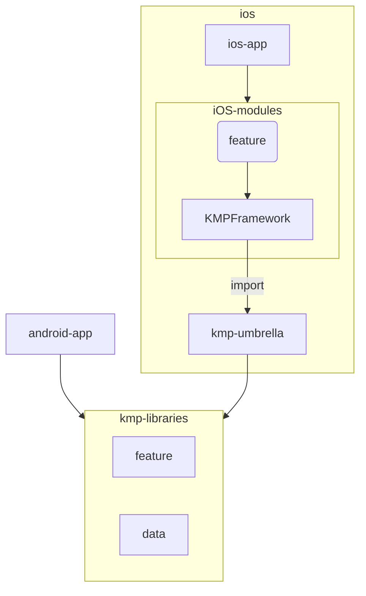

tst
# Sample Project - KMP + Tuist Multiplatform App

> [日本語版はこちら / Japanese version](./doc/README.ja.md)

This project is a reference implementation of an iOS/Android multiplatform application using Kotlin Multiplatform (KMP) and Tuist.

## Prerequisites

- [mise](https://github.com/jdx/mise) - Used for managing development tool versions

## Setup

### 1. Install Dependencies

```bash
# Install required tools with mise
mise install
```

### 2. Build Android App

```bash
# Build Android app using Gradle
./gradlew android-app:build
```

### 3. Generate iOS Project

```bash
# Generate project with Tuist
mise run ios-gen
```

## Project Structure

```
sample-project/
├── android-app/          # Android application
├── ios/                  # iOS project (managed by Tuist)
│   ├── ios-app/         # Main iOS app
│   ├── Feature/         # iOS-specific feature modules
│   ├── KMPFramework/    # Wrapper framework for KMP code
│   └── kmp-umbrella/    # Public interface for KMP libraries
├── kmp-libraries/        # Shared KMP libraries
│   └── feature/         # Common feature modules
└── build-logic/          # Gradle Convention Plugins
```



## Development Commands

### iOS Development

```bash
# Generate project
mise run ios-gen

# Edit Tuist manifests
mise run ios-edit

# Clean project
mise run ios-clean
```

### Android Development

```bash
# Build
./gradlew android-app:build

# Install
./gradlew android-app:installDebug

# Run tests
./gradlew test
```

## Convention Plugins
The `build-logic/` directory contains custom Convention Plugins that provide reusable build configurations.
