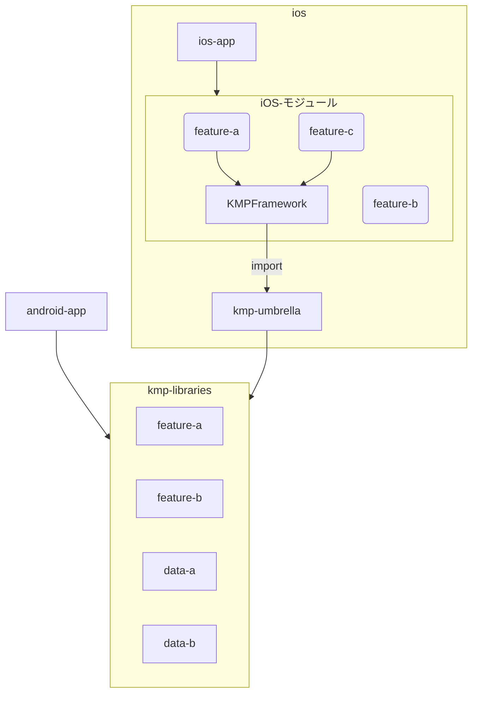

# CLAUDE.md

## 前提条件

- 回答は必ず日本語でしてください。
- コードの変更をする際、変更量が200行を超える可能性が高い場合は、事前に「この指示では変更量が200行を超える可能性がありますが、実行しますか?」とユーザーに確認をとるようにしてください。
- 何か大きい変更を加える場合、まず何をするのか計画を立てた上で、ユーザーに「このような計画で進めようと思います。」と提案してください。この時、ユーザーから計画の修正を求められた場合は計画を修正して、再提案をしてください。

## アプリ概要

Topicを立てるとそのTopicにコメントしたりリアクションがとれたりするアプリです。
SNSではなく、特定のコミュニティーに限定した使い方が想定されています。

## 技術スタック

- Kotlin Multiplatform
- Tuist
- mise
- Firebase FireStore
- Firebase Authentication

## ディレクトリ構成

アーキテクチャ参照

## アーキテクチャ
### Overview



### Module Structure

The project follows a modular architecture with three main modules:

1. **android-app** - Android application module
    - Entry point for Android app
    - Uses KMP libraries via `projects.kmpLibraries.feature`
    - Package namespace: `okoge.house.sophie`

2. **kmp-libraries:feature** - Shared KMP library
    - Contains shared business logic and UI using Compose Multiplatform
    - Targets: Android, iOS (iosArm64, iosSimulatorArm64)
    - Uses `convention.kmp.feature` plugin
    - Package namespace: `okoge.house.sophie.feature`

3. **ios:kmp-umbrella** - iOS framework wrapper
    - Umbrella module that exposes KMP code to iOS
    - Compiled into a framework consumed by the iOS app
    - Gradle task builds framework during Xcode build phase

### iOS Project Structure (Tuist)

The iOS app uses Tuist for project generation with three targets:

- **ios-app**: Main iOS application (depends on Feature framework)
- **KMPFramework**: Wrapper framework that compiles Kotlin code via Gradle
- **Feature**: Swift framework for iOS-specific feature code (depends on KMPFramework)

The KMPFramework target runs `./gradlew :ios:kmp-umbrella:embedAndSignAppleFrameworkForXcode` as a pre-build script to compile the Kotlin framework.

### Build-Logic System

Custom convention plugins in `build-logic/` provide reusable build configuration:

**Convention Plugins:**
- `convention.kmp.feature` - Combines all primitive plugins for KMP feature modules

**Primitive Plugins:**
- `primitive.kmp` - Base KMP setup with Android and androidTarget
- `primitive.kmp.ios` - iOS targets (iosArm64, iosSimulatorArm64)
- `primitive.kmp.compose` - Compose Multiplatform configuration
- `primitive.compose.resources` - Compose resources support
- `primitive.metro` - Metro plugin for dependency injection
- `primitive.kmp.skie` - SKIE for improved Kotlin-Swift interop

### Package Naming Convention

The `getDefaultPackageName()` utility generates Android namespaces automatically:
- Format: `okoge.house.sophie.${moduleName.replace("-", "_")}`
- Example: module `kmp-libraries` → `okoge.house.sophie.kmp_libraries`

### Dependency Management

- Uses Gradle Version Catalog (`gradle/libs.versions.toml`)
- TYPESAFE_PROJECT_ACCESSORS enabled - use `projects.kmpLibraries.feature` syntax for inter-module dependencies
- Import libraries as `implementation(libs.androidx.activity.compose)` NOT FQFNs

## テスト方針
- TBD

## アンチパターン
### Kotlin
- FQFNではなくできるだけimportを使う
```kt
androidx.compose.material3.MaterialTheme {} // NG

// OK
import androidx.compose.material3.MaterialTheme
MaterialTheme {} 
```
### Gradle
- `enableFeaturePreview("TYPESAFE_PROJECT_ACCESSORS")` を使っているので,モジュールの依存は `implementation(projects.${module-name})`という表記でかく。このfeatureがない場合は`settings.gradle.kts`に追加する。
- build logic の一元管理のため できるだけcomposit buildを使う

# まとめ

このドキュメントを常に最新に保ち、新しい技術選定や設計変更があった場合は適宜更新してください。GitHub Copilot や AI ツールは、このドキュメントを参照することで、プロジェクトのコンテキストを正確に理解し、より適切なコード提案を行うことができます。
