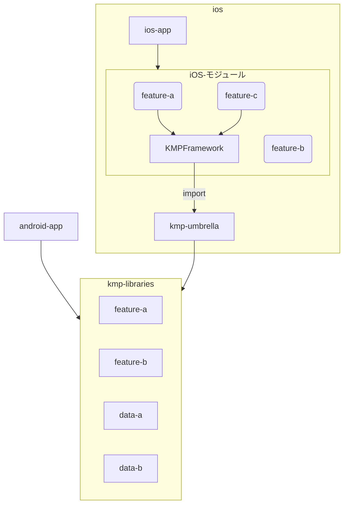

# Sample Project - KMP + Tuist マルチプラットフォームアプリ

このプロジェクトは、Kotlin Multiplatform (KMP) と Tuist を使用したiOS/Androidマルチプラットフォームアプリのリファレンス実装です。

## 📱 アプリ概要

Topicを立ててコメントやリアクションができるコミュニティアプリです。SNSではなく、特定のコミュニティー内での利用を想定しています。

## ✨ 主な特徴

- **Kotlin Multiplatform**: iOS/Android間でビジネスロジックとUIコードを共有
- **Compose Multiplatform**: 宣言的UIフレームワークによるクロスプラットフォームUI
- **Tuist**: iOSプロジェクトの依存関係とビルド設定を管理
- **モジュラーアーキテクチャ**: 機能ごとにモジュール化された保守性の高い設計

## 🛠️ 技術スタック

- **Kotlin Multiplatform** - クロスプラットフォーム開発
- **Compose Multiplatform** - 宣言的UI
- **Tuist** - iOSプロジェクト管理
- **mise** - 開発ツールのバージョン管理
- **Firebase Firestore** - データベース
- **Firebase Authentication** - 認証
- **SKIE** - Kotlin-Swift相互運用性の向上
- **Metro** - 依存性注入

## 📋 前提条件

- [mise](https://github.com/jdx/mise) - 各種開発ツールのバージョン管理に使用

## 🚀 セットアップ

### 1. 依存関係のインストール

```bash
# miseで必要なツールをインストール
mise install
```

### 2. Androidアプリのビルド

```bash
# Gradleを使用してAndroidアプリをビルド
./gradlew android-app:build
```

### 3. iOSプロジェクトの生成

```bash
# Tuistでプロジェクトを生成
mise run ios-gen

# Xcodeで開く
open ios/App.xcworkspace
```

## 📂 プロジェクト構成

```
sample-project/
├── android-app/          # Androidアプリケーション
├── ios/                  # iOSプロジェクト (Tuist管理)
│   ├── ios-app/         # メインiOSアプリ
│   ├── Feature/         # iOS専用機能モジュール
│   ├── KMPFramework/    # KMPコードのラッパーフレームワーク
│   └── kmp-umbrella/    # KMPライブラリの公開インターフェース
├── kmp-libraries/        # 共有KMPライブラリ
│   └── feature/         # ビジネスロジックとUI
└── build-logic/          # Gradle Convention Plugins
```

## 🏗️ アーキテクチャ

### モジュール構成



### 主要モジュール

1. **android-app** - Androidアプリのエントリーポイント
   - KMPライブラリを `projects.kmpLibraries.feature` 経由で使用

2. **kmp-libraries:feature** - 共有KMPライブラリ
   - Compose Multiplatformを使用したビジネスロジックとUI
   - ターゲット: Android, iOS (iosArm64, iosSimulatorArm64)

3. **ios:kmp-umbrella** - iOSフレームワークラッパー
   - KMPコードをiOSに公開するアンブレラモジュール
   - Xcodeビルド時にGradleタスクでフレームワークをビルド

### iOSプロジェクト構成 (Tuist)

- **ios-app**: メインiOSアプリケーション (Featureフレームワークに依存)
- **KMPFramework**: GradleでコンパイルされるKotlinコードのラッパー
- **Feature**: iOS固有の機能コード (KMPFrameworkに依存)

## 🔧 開発コマンド

### iOS開発

```bash
# プロジェクト生成
mise run ios-gen

# Tuistマニフェスト編集
mise run ios-edit

# プロジェクトクリーン
mise run ios-clean
```

### Android開発

```bash
# ビルド
./gradlew android-app:build

# インストール
./gradlew android-app:installDebug

# テスト実行
./gradlew test
```

## 🔌 Convention Plugins

`build-logic/` には再利用可能なビルド設定を提供するカスタムConvention Pluginsがあります：

**Convention Plugins:**
- `convention.kmp.feature` - KMP機能モジュール用の統合プラグイン

**Primitive Plugins:**
- `primitive.kmp` - 基本的なKMPセットアップ (Android + androidTarget)
- `primitive.kmp.ios` - iOSターゲット (iosArm64, iosSimulatorArm64)
- `primitive.kmp.compose` - Compose Multiplatform設定
- `primitive.compose.resources` - Composeリソースサポート
- `primitive.metro` - 依存性注入
- `primitive.kmp.skie` - Kotlin-Swift相互運用性の向上

## 📦 依存関係管理

- Gradle Version Catalog (`gradle/libs.versions.toml`) を使用
- `TYPESAFE_PROJECT_ACCESSORS` を有効化
  - プロジェクト間依存: `implementation(projects.kmpLibraries.feature)`
  - ライブラリ依存: `implementation(libs.androidx.activity.compose)`

## 📝 コーディング規約

### Kotlin
- FQFNではなくimportを使用

```kotlin
// ❌ NG
androidx.compose.material3.MaterialTheme {}

// ✅ OK
import androidx.compose.material3.MaterialTheme
MaterialTheme {}
```

### Gradle
- `TYPESAFE_PROJECT_ACCESSORS` を使用してモジュール依存を記述
- ビルドロジックの一元管理のため、できるだけComposite Buildを使用

## 🤝 貢献

このプロジェクトはリファレンス実装として、KMP + Tuistのベストプラクティスを示すことを目的としています。

## 📄 ライセンス

このプロジェクトの詳細については、プロジェクトルートのREADMEを参照してください。

---

詳細な技術情報やアーキテクチャについては [CLAUDE.md](./CLAUDE.md) を参照してください。
