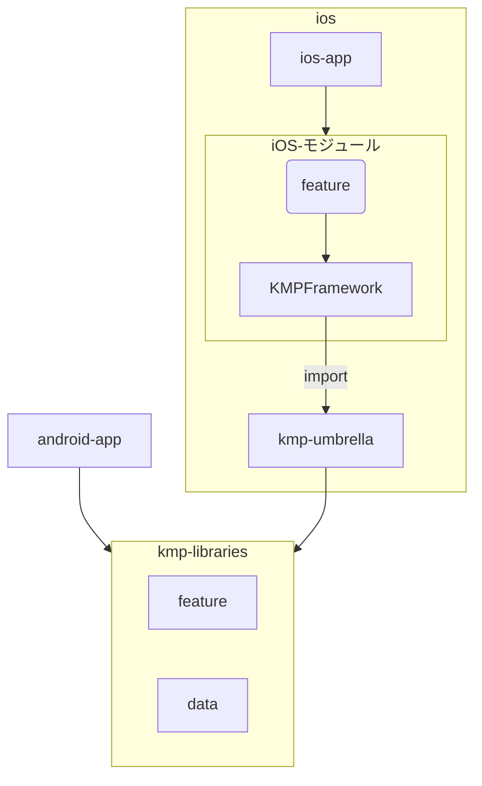

# Sample Project - KMP + Tuist マルチプラットフォームアプリ

このプロジェクトは、Kotlin Multiplatform (KMP) と Tuist を使用したiOS/Androidマルチプラットフォームアプリのリファレンス実装です。

## 前提条件

- [mise](https://github.com/jdx/mise) - 各種開発ツールのバージョン管理に使用

## セットアップ

### 1. 依存関係のインストール

```bash
# miseで必要なツールをインストール
mise install
```

### 2. Androidアプリのビルド

```bash
# Gradleを使用してAndroidアプリをビルド
./gradlew android-app:build
```

### 3. iOSプロジェクトの生成

```bash
# Tuistでプロジェクトを生成
mise run ios-gen
```

## プロジェクト構成

```
sample-project/
├── android-app/          # Androidアプリケーション
├── ios/                  # iOSプロジェクト (Tuist管理)
│   ├── ios-app/         # メインiOSアプリ
│   ├── Feature/         # iOS専用機能モジュール
│   ├── KMPFramework/    # KMPコードのラッパーフレームワーク
│   └── kmp-umbrella/    # KMPライブラリの公開インターフェース
├── kmp-libraries/        # 共有KMPライブラリ
│   └── feature/         # 共通機能モジュール
└── build-logic/          # Gradle Convention Plugins
```



## 開発コマンド

### iOS開発

```bash
# プロジェクト生成
mise run ios-gen

# Tuistマニフェスト編集
mise run ios-edit

# プロジェクトクリーン
mise run ios-clean
```

### Android開発

```bash
# ビルド
./gradlew android-app:build

# インストール
./gradlew android-app:installDebug

# テスト実行
./gradlew test
```

## Convention Plugins

`build-logic/` には再利用可能なビルド設定を提供するカスタムConvention Pluginsがあります
